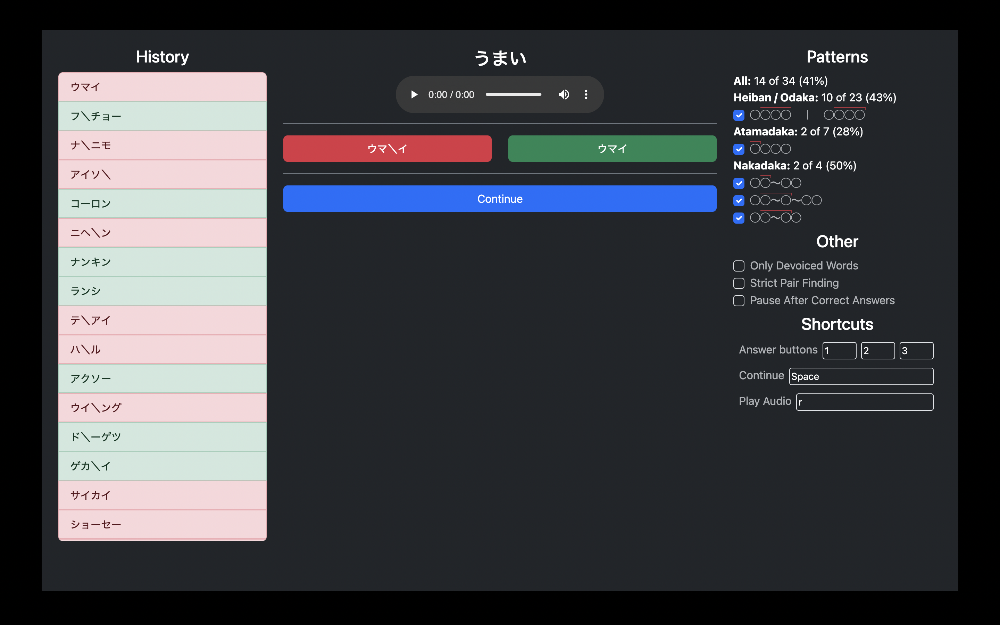
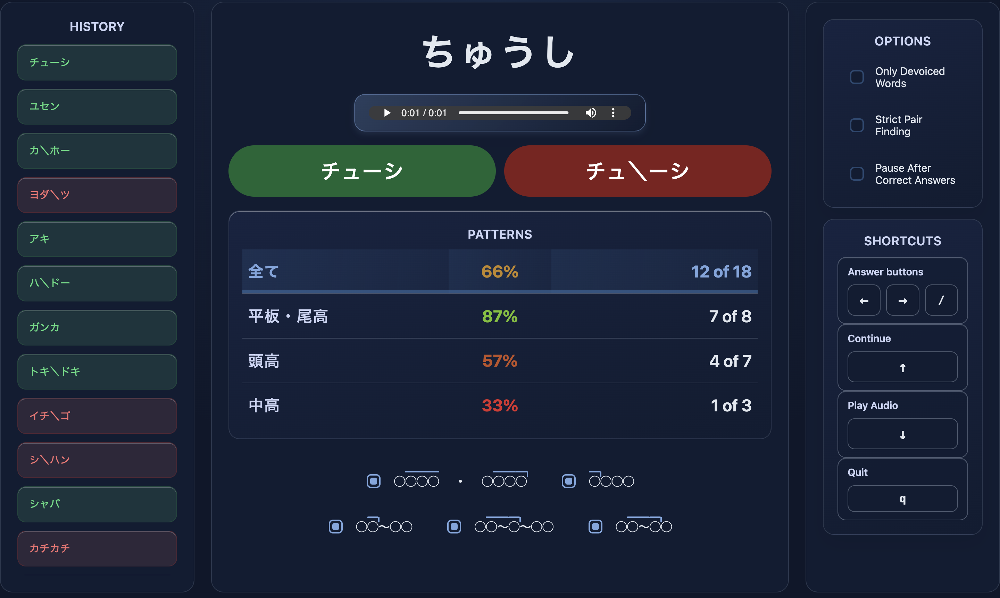

# Minimal Pairs

A fork of [Kuuuube/minimal-pairs](https://github.com/Kuuuube/minimal-pairs)
which is itself a backup of the [コツ minimal pairs test](https://kotu.io/tests/pitchAccent/perception/minimalPairs).

## Install

    gh repo clone constkolesnyak/minimal-pairs
    pipx install ./minimal-pairs
    rm -rf minimal-pairs

_Don't do this:_ `pipx install git+https...`

## Run

    kmpt

## My Changes

- A bit here and there
- More of Python
- Better UI

## Before vs After

